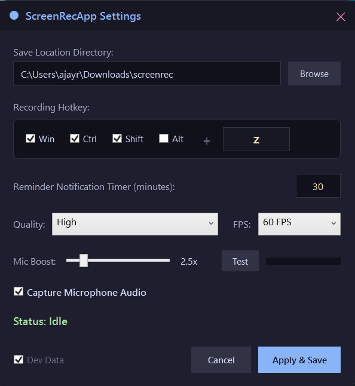
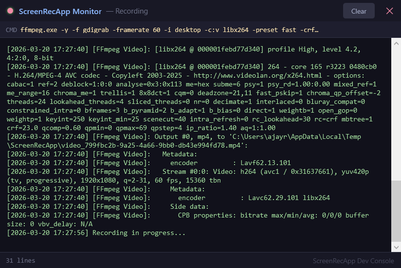

# Sound Service Broker (ScreenRecApp)

A background utility for hardware-accelerated screen and audio recording on Windows. Built using C#, WPF, and FFmpeg, it focuses on remaining inconspicuous in the system tray while providing robust capture capabilities.

## Technical Overview

The application runs as a background process and is controlled entirely via a global keyboard hook. It captures desktop video via gdigrab and system/microphone audio via NAudio (WASAPI), muxing them into optimized MP4 files upon completion.

### Core Capabilities

*   **Inconspicuous Operation:** The process is registered and displayed as "Sound Service Broker" in the system tray and Task Manager. System notifications regarding capture events use generic text to avoid drawing attention during screen shares.
*   **Low-latency Global Hotkeys:** Registers a system-wide hook (HwndSource) to ensure the configured shortcut (default: Shift + Ctrl + Win + Z) works globally, including full-screen applications.
*   **Dual-Channel Audio:** Captures both system loopback audio and microphone input simultaneously. The application includes an optional microphone software volume booster, and a toggle to disable microphone capture entirely if strict system-audio-only recording is required.
*   **Performance Tracking:** Includes a Developer Monitor console that logs FFmpeg pipeline status. To preserve CPU and disk I/O, statistical per-frame logging is throttled by default unless explicitly needed for debugging.
*   **Long-Duration Reliability:** Contains specific logic to prevent MP4 file corruption on long recordings (e.g., 2+ hours). It forces garbage collection and trims the application working set immediately after muxing to ensure idle memory usage remains negligible (near 20MB).
*   **Web-Optimized Output:** The muxing phase automatically applies the `-movflags +faststart` flag and encodes audio to 192kbps AAC, resulting in videos that can be streamed immediately upon uploading.
*   **Collision-Proof File Saving:** Generates suggested file names using a strict DD.MM.YY_HH.MM.SS_ format.

## System Requirements and Installation

The application is distributed as a self-contained, portable executable. It does not require a .NET runtime installation.

1.  Download the latest release archive.
2.  Extract the contents to a standard directory.
3.  Ensure `ffmpeg.exe` is present in the exact same directory as `SoundServiceBroker.exe`. This is bundled by default in the official release package.
4.  Run `SoundServiceBroker.exe`.

## Configuration and Usage

Upon starting, the application runs silently in the system tray. 

**Settings Configuration**
Double-click the tray icon to open the configuration window. Available settings include:
*   Customizing the global shortcut key and modifiers.
*   Video quality presets (High, Medium, Low) and capture framerate (15, 30, 60 FPS).
*   Microphone toggle, volume multiplier, and live test levels.
*   Enabling or disabling Developer logging.

<p align="center">
  
</p>

**Recording Lifecycle**
1.  Press the global hotkey to initiate capture. 
2.  Press the hotkey again to stop. A progress window will indicate that the application is actively mixing the audio and video tracks. 
3.  Once processing is complete, a prompt allows you to choose the final file name and save location.

If "Developer Mode" is enabled in settings, the Monitor Console will appear automatically when recording begins, displaying FFmpeg commands and a throttled activity heartbeat.

<p align="center">
  
</p>

## Building from Source

To compile the application manually, the .NET 9.0 SDK is required.

```bash
git clone https://github.com/ajayraho/screenrec.git
cd screenrec/ScreenRecApp

dotnet publish -c Release -r win-x64 --self-contained true -p:PublishReadyToRun=true
```

Ensure `ffmpeg.exe` is placed in the output directory (`bin/Release/net9.0-windows/win-x64/publish/`) alongside the executable before running.

*Note: Desktop capture relies on the gdigrab input device. Recording hardware-encrypted DRM streams (e.g., Netflix via Edge) may result in a black screen due to OS-level HDCP protections.*

---

Made with ❤️ by Ajit K.